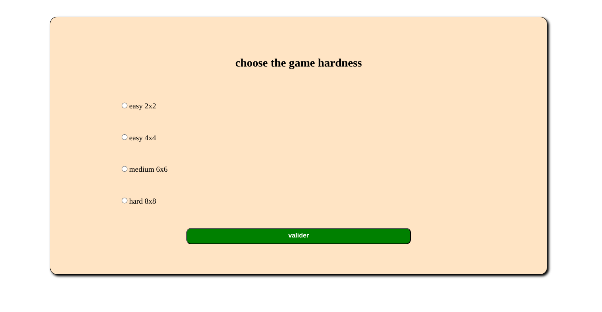
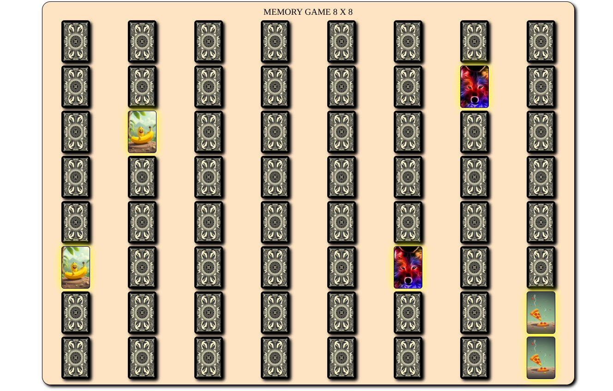
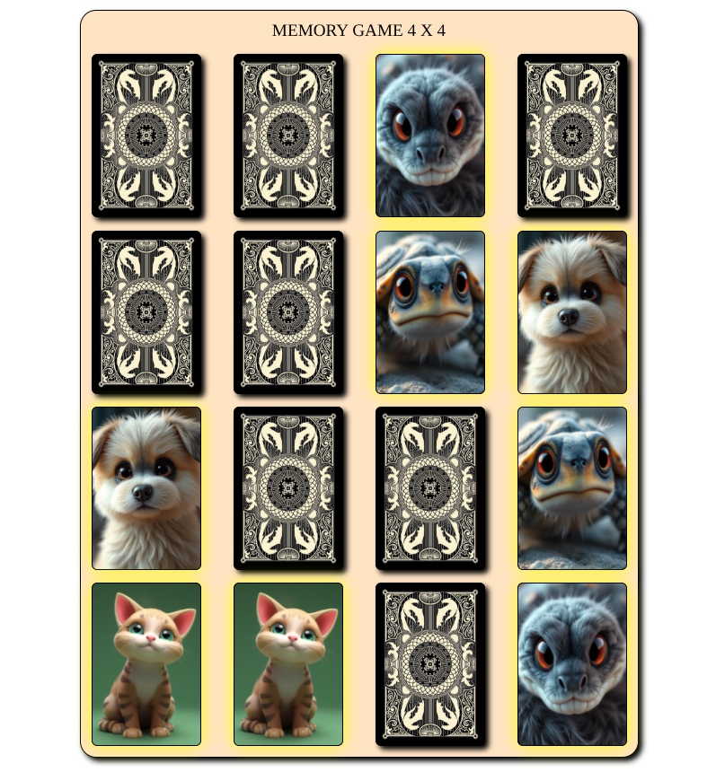
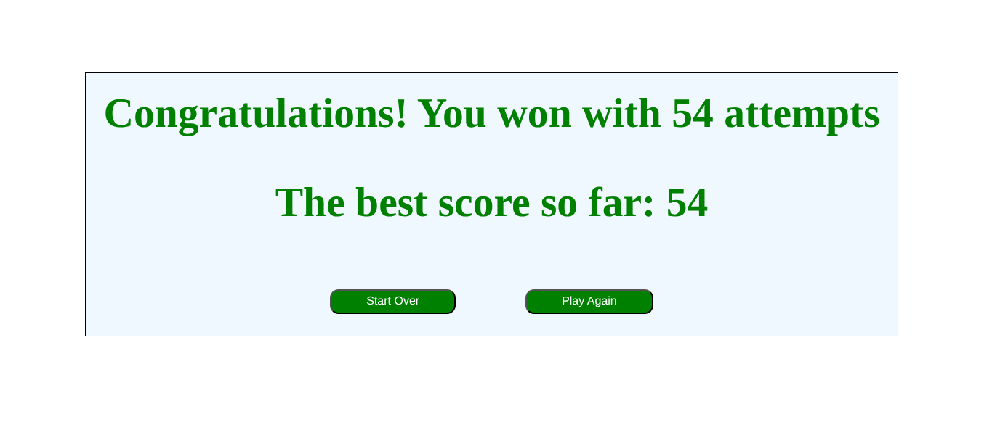

# 🧩 Memory Game – Play the DOM!

## Description
Memory Game is an interactive web mini-game designed to help users develop their DOM manipulation skills in JavaScript. The goal is to find all matching pairs of cards in the shortest possible number of attempts.


**Technologies used:** HTML5, CSS3, JavaScript, Flexbox, Responsive Design, Local Storage.

---

## Features

- Dynamically generated game grid using JavaScript.
- Clickable cards that flip to reveal an image or icon.
- Only two cards can be flipped at a time.
- Matching pairs stay visible; unmatched cards flip back after a short delay.
- Score tracking: attempts and best score saved in Local Storage.
- Victory message/animation displayed when all pairs are found.
- Option to restart the game easily.

### Bonus Features
- Difficulty levels: 4x4, 6x6, 8x8 grids.
- Smooth animations for better UX.

---

## Installation

1. Clone the repository:
   ```bash
   git clone <https://github.com/elgmouriabderrahim/brief4-Memory_Game.git>

## Screenshots




